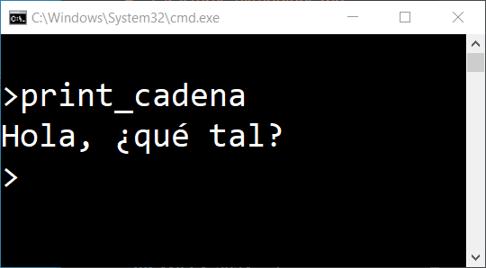
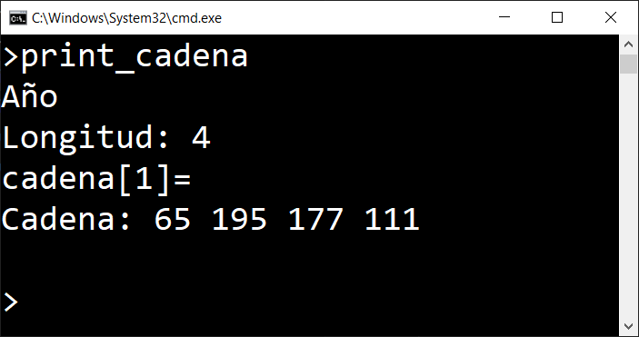
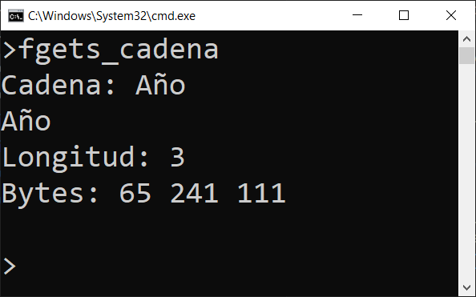
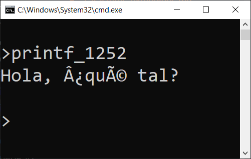
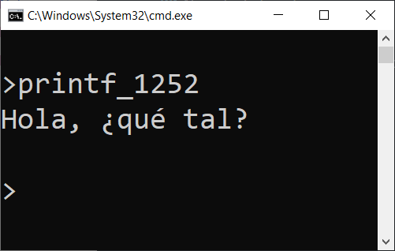

# Utilización del juego de caracteres extendido

## Sistemas de codificación de caracteres

El sistema de codificación [ASCII](https://es.wikipedia.org/wiki/ASCII) comprende los valores entre 0 y 127. Del 0 al 31 son caracteres especiales, por ejemplo, el valor 10 corresponde al cambio de línea `\n` que usamos habitualmente en los programas. Desde el 32 hasta el 127 son los caracteres *imprimibles*. Los caracteres imprimibles incluyen todas las letras del alfabeto inglés, en mayúsculas y minúsculas, los dígitos numéricos y algunos caracteres especiales. No incluye las letras acentuadas o la letra *ñ*, por poner un ejemplo.

Se denomina **ASCII extendido** a cualquier *juego de caracteres* de 8 bits en el cual, los códigos 32 a 126 (0x20 a 0x7E) coinciden con los caracteres imprimibles de ASCII,
 así como los caracteres comúnmente llamados *de espacio*, que son los códigos de control de 8 a 13 (0x08 a 0x0D), ambos inclusive.

Las codificaciones de ASCII extendido utilizan además parte o la totalidad de los códigos superiores a 128 para codificar caracteres  adicionales a los caracteres imprimibles ASCII. 

Las codificaciones ASCII extendido más comunes son:

- [Página de códigos 437](https://es.wikipedia.org/wiki/P%C3%A1gina_de_c%C3%B3digos_437 "Página de códigos 437"), usual en las versiones en inglés del IBM PC y MS-DOS.
- [Página de códigos 850](https://es.wikipedia.org/wiki/P%C3%A1gina_de_c%C3%B3digos_850 "Página de códigos 850"), usual en las versiones de Europa occidental del IBM PC y MS-DOS.
- *Latin-1* ([ISO-8859-1](https://es.wikipedia.org/wiki/ISO-8859-1 "ISO-8859-1")), típico de Unix y, con modificaciones, en Microsoft Windows ([Windows-1252](https://es.wikipedia.org/wiki/Windows-1252 "Windows-1252")) y Macintosh.

Todas estas codificaciones utilizan un byte para representar un carácter y permiten representar las letras habituales en los idiomas de Europa occidental: Francia, España, Alemania, Italia y otros. En cambio, el juego de caracteres que ofrecen es limitado. Por ejemplo, no permiten representar la letra griega *alpha*, &alpha;, o el símbolo del Euro, &euro;.

Actualmente se impone la utilización del sistema de codificación **Unicode**. Este sistema utiliza entre 1 y 4 bytes para representar cada caracter. La codificación más extendida es Unicode UTF-8. UTF-8 es compatible con ASCII y es la codificación que utilizan los sistemas Linux, Mac y todas las páginas Web. En cambio, el sistema operativo Windows utiliza el sistema de codificación Unicode UTF-16 que, entre otras cosas, no es compatible con ASCII. Esto complica bastante la utilización del juego de caracteres extendido en los terminales Windows.

## El tipo *char* en C

En el lenguaje C, el tipo *char* que se utiliza para representar caracteres utiliza un byte de almacenamiento y, por tanto, no permite la utilización de la codificación Unicode. 

En realidad, el tipo *char* utiliza un entero con signo de un byte y permite guardar valores entre -128 y +127. Se puede utilizar el tipo *unsigned char*, en cuyo caso permitirá valores positivos entre 0 y 255. De esta forma, se pueden aprovechar los juegos de caracteres de las codificaciones ASCII Extendidas.

Las cadenas de caracteres son arrays de caracteres individuales cuyo último elemento es un `\0`.

Cuando se escribe un literal entrecomillado en el editor de texto, se guardará en el disco con la codificación de caracteres que utilice el editor. El compilador *GCC*, por defecto, supone que los ficheros fuente de los programas están escritos con codificación UTF-8. Por ello, mi recomendación es que se use esta codificación en los ficheros fuente que se escriben en VSCode.

Los terminales de Linux o Mac utilizan por defecto el sistema de codificación UTF-8. En cambio, en Windows, a la fecha de escribir estas líneas, el terminal no soporta la codificación UTF-8 para entrada de caracteres. 

Sí que se puede usar UTF-8 para salida de cadenas. Un ejemplo podría ser el siguiente código:

```c
#include <stdio.h>
#include <windows.h>

int main() {
    SetConsoleOutputCP(65001);
    char cadena[] = "Hola, ¿qué tal?";
    printf("%s\n", cadena);
}
```

La función *SetConsoleOutput(65001)* de la librería *windows.h* lo que hace es establecer el sistema de codificación UTF-8 en el terminal en el que se está ejecutando el programa. A continuación se declara y asigna una cadena con algunos caracteres especiales. Por último se imprime en pantalla. La salida del programa en mi ordenador es la siguiente:



Hay que entender que, cuando se utiliza UTF-8, los caracteres pueden utilizar entre 1 y 4 bytes. Por ejemplo, el carácter `ñ`, consta de dos bytes: el primero un 195 y el segundo 177.

Por la forma de actuar de la función *printf()* la cadena de caracteres UTF-8 se imprime correctamente en pantalla, incluso en Windows, pero si tratamos de contar caracteres con la función *strlen()*, lo que obtendremos es el número de bytes de la cadena, no el número de caracteres. De la misma forma, si intentamos acceder a caracteres individuales mediante el índice que ocupa el carácter en la cadena, también podemos obtener resultados inesperados. Observa el siguiente código:

```c
#include <stdio.h>
#include <windows.h>
#include <string.h>

void disp_bytes(char* cad) {
    printf("Cadena: ");
    for(int i=0; i<strlen(cad); i++) {
        printf("%hhu ", cad[i]);
    }
    printf("\n");
}
int main() {

    SetConsoleOutputCP(65001);
    unsigned char cadena[] = "Año";

    printf("%s\n", cadena);
    printf("Longitud: %d\n", strlen(cadena));
    printf("cadena[1]= %c\n", cadena[1]);
    disp_bytes(cadena);
}
```

La salida de este programa en mi ordenador con Windows es la siguiente:



Observa que los dos bytes centrales de la cadena son 195 y 177, que es el código UTF-8 de la letra `ñ`.

Así como incluir caracteres de más de un byte en una cadena puede funcionar para hacer salidas por pantalla, no funciona si uno de estos caracteres se intenta asignar a una variable *char*, que solo utiliza un byte. Si intentas compilar una línea de código como la siguiente, teniendo el editor configurado en UTF-8 obtendrás un error:

```c
char c = 'ñ';
```

Tampoco es posible hacer lecturas de cadenas que contengan caracteres especiales,  a través del terminal de Windows, utilizando la codificación UTF-8 y funciones como *fgets()* o *scanf()*.

### Utilización de la codificación Windows-1252

El terminal de Windows utiliza por defecto la página de códigos 850. Se trata de una codificación antigua heredada de los viejos sistemas MS-DOS. Con posterioridad, Windows creó la codificación denominada *Windows-1252*, que es muy similar a la codificación ISO-8859-1, pero no idéntica. Se trata de un juego de caracteres extendido, que utiliza un solo byte para cada carácter y aprovecha los códigos 128 a 255 para dar soporte a las letras especiales de los alfabetos de los paises de Europa Occidental. Incluye letras acentuadas, la letra ñ y otros caracteres.

Utilizando la codificación Windows-1252 sí que es posible hacer entradas de cadenas que contengan caracteres especiales utilizando el terminal de Windows. Observa el siguiente código:

```c
#include <stdio.h>
#include <string.h>
#include <windows.h>

void disp_bytes(char* cad) {
    printf("Bytes: ");
    for(int i=0; i<strlen(cad); i++) {
        printf("%hhu ", cad[i]);
    }
    printf("\n");
}
void limpia_endofline(char* cad) {
    if(cad[strlen(cad)-1] == '\n') {
        cad[strlen(cad)-1] = '\0';
    }
}
int main() {
    SetConsoleOutputCP(1252);

    char cad[80];
    printf("Cadena: ");
    fgets(cad, 80, stdin);
    limpia_endofline(cad);
    printf("%s\n", cad);
    printf("Longitud: %d\n", strlen(cad));
    disp_bytes(cad);
}
```

El programa establece la página de códigos Windows-1252 y después le pide una cadena al usuario. La cadena se limpia del `\n`residual y luego se imprime su longitud y los bytes de los que consta. 

La figura siguiente muestra la ejecución del programa cuando el usuario teclea la cadena *Año*. Ahora la longitud de la cadena es la correcta y el código de la letra *ñ* es el 241, que es el que le corresponde en la codificación 1252.



Si el editor VSCode lo tenemos configurado en UTF-8 y escribimos un literal entrecomillado que contenga caracteres especiales, no podremos verlo correctamente utilizando en el terminal la codificación 1252. Observa el código siguiente:

```c
#include <stdio.h>
#include <windows.h>

int main() {

    SetConsoleOutputCP(1252);

    char cad[] = "Hola, ¿qué tal?";
    printf("%s\n", cad);
}
```

Si ejecutas ese programa, la salida será similar a la siguiente:



¿Qué está sucediendo? El fichero fuente que se escribe en el disco no contiene las letras del literal entrecomillado, sino los códigos que les correspondan a dichas letras en la codificación de caracteres que utilice el editor. Como el editor VSCode está configurado con UTF-8, al escribir en el disco el literal entrecomillado, escribe los códigos UTF-8 y, al intentar imprimirlos utilizando la codificaión 1252 que se ha seleccionado para el terminal, se producen errores.

Una solución podría ser utilizar la codificación 1252 también en el editor de texto y guardar en el disco el fichero fuente con la codificación 1252. Si se hace así, la salida del programa anterior sería la siguiente:



Aunque la solución de utilizar la codificación 1252 en el editor y en el terminal podría resolver determinadas situaciones, personalmente creo que no es una buena solución. Por una parte, la codificación 1252 es muy limitada y hay muchos caracteres de uso habitual que no están incluidos, por ejemplo la letra griega *alpha*, α, o el símbolo del Euro, €. Por otra parte, hacerse incompatible con otros programadores, a la hora de intercambiar ficheros fuente, o de subirlos a un repositorio de Guthub, por ejemplo, daría más quebraderos de cabeza que los que supone utilizar otras soluciones más adecuadas para utilizar caracteres especiales.

La imagen siguiente muestra el contenido del ejemplo anterior, guardado en codificación 1252,  cuando se sube a un repositorio de Github:


Observa que el entrecomillado no se ve bien. Hay que tener en cuenta una cosa: los ficheros de texto no tienen ninguna indicación de la codificación que se ha utilizado para escribirlo. No es posible saber con seguridad qué codificación de caracteres se ha utilizado para crear un fichero de texto. En la Web se da por hecho que todos los contenidos están codificados en UTF-8. Si se usa otra codificación, lo más probable es que haya problemas.

### Situación en Mac y Linux

En Mac y Linux los terminales utilizan por defecto la codificación UTF-8 y es posible escribir cadenas con caracteres especiales o leerlas utilizando *fgets()* o *scanf()*. Observa el siguiente código:

```c
#include <stdio.h>

int main() {

    char cad[] = "Hola, ¿qué tal?";
    printf("%s\n\n", cad);

    char cad2[80];
    printf("Teclea cadena: ");
    fgets(cad2, 80, stdin);
    printf("%s", cad2);
}
```

Para el fichero fuente se ha usado VSCode con codificación UTF-8 y se ha ejecutado en el terminal de un ordenador con sistema operativo Linux Ubuntu.  La salida del programa es la siguiente:


Lo que no se puede hacer tampoco en Linux ni en Mac es asignar un carácter multi-byte a una variable del tipo *char*. También se tendrán los mismos problemas que se han comentado en Windows si se utilizan funciones como *strlen()* o se intenta acceder a un carácter individual de una cadena que tenga algunos caracteres especiales utilizando un índice.

## El tipo *wchar_t* en C

El lenguaje C ofrece tres tipos de tratamientos para los distintos juegos de caracteres:

- Caracteres de 1 byte: es el tipo *char* que permite dar cobertura a la codificación ASCII y a las codificaciones ASCII extendidas.

- Caracteres anchos: es el tipo *wchar_t* que permite dar cobertura a la codificaciones Unicode.

- Caracteres multi-byte: permite resolver el problema asociado con otras codificaciones no Unicode que utilizan más de un byte para representar los caracteres.

> La letra *w* de *wchar* se refiere a la palabra *wide*, que en inglés significa *ancho*. Por ello, es frecuente ver traducido el tipo como *caracteres anchos*.

El tipo *wchar_t* de la librería *wchar.h* permite trabajar con caracteres UTF-8 de manera muy similar a la forma de trabajar con caracteres del tipo *char*. 

La librería *wchar.h* ofrece funciones de nombres similares a las de las librería *stdio.h* y *string.h*, pero que añaden una letra *w* al principio o en medio del nombre de la función, para indicar que es una función destinada a usar el tipo *wchar_t*.

La siguientes figuras muestran una comparación entre las funciones de la librería *wchar.h* y sus equivalentes cuando se trabaja con caracteres tipo *char*.


Para asignar valor a un carácter del tipo *wchar_t* utilizando un literal entrecomillado hay que poner la letra *L* mayúscula delante de la comilla de apertura. Igual que en el caso del tipo *char*, se utilizan comillas simples:

```c
wchar_t c = L'ñ';
```

También es posible asignar el código UTF-8 coprrespondiente al carácter:

```c
wchar_t c = 0x3B1; // Símbolo del Yen japonés
```

Las cadenas de caracteres *wchar_t* son arrays cuyos elementos son *wchar_t*. Al igual que sucede con las cadenas del tipo *char*, las cadenas de *wchar_t* finalizan con un `\0`, que el compilador añade durante la asignación. Para asignar un literal entrecomillado a una variable de cadena del tipo *wchar_t* hay que poner una letra *L* mayúscula delante de las comillas de apertura, lo que le indica al compilador que la cadena de caracteres se debe interpretar como una cadena de caracteres *wchar_t*:

```c
wchar_t* cadena = L"Cadena de caracteres anchos";
```

La utilización de los caracteres de cualquier tipo en el terminal del ordenador está limitada por juego de caracteres del que disponga la fuente de letra que use el terminal (la fuente de letra es, por ejemplo, Courier u otra) . No todos los caracteres UTF-8 tiene por qué estar disponibles en nuestro terminal.

Para utilizar las funciones de entrada o salida de *wchar_t* en nuestro ordenador, primero hay que activar las características locales del mismo, pues el compilador de C no las activa por defecto. Esto se consigue con la función *setlocale()* de la librería *locale.h*. Utilizando la siguiente instrucción, se activan las características locales del ordenador en el que se ejecute el programa:

```c
setlocale(LC_ALL, "");
```

También es posible activar un *locale* concreto, que nop tiene por qué coincidir con el que tenga configurado en ese momento el ordenador:

```c
setlocale(LC_ALL, "es_ES.UTF-8";
```

Una vez activado el entorno local, se pueden usar las funciones de entrada y salida de la librería *wchar.h*.

La especificación de formato en la cadena de formato de las instrucciones de entrada y salida añade una letra `l`minúscula delante de la letra `c`o `s`, según se trate de un solo carácter o de una cadena:

-  `%lc`: especificación de formato de un caracter del tipo *wchar_t*.

- `%ls`: especificación de formato de una cadena de caracteres del tipo *wchar_t*.

Además, la propia cadena de formato se debe preceder con la letra `L`mayúscula. Por ejemplo:

```c
wchar_t alpha = 0x3B1;
wprintf(L"%lc\n", alpha);
```

El siguiente ejemplo de código muestra cómo declarar literales *wchar_t* y mostrarlos en pantalla utilizando la función *wprintf()*, que sería la función equivalente a *printf()*, pero trabajando con caracteres anchos:

```c
#include <stdio.h>
#include <locale.h>
#include <wchar.h>

int main() {
   // Activar las fuentes locales
   setlocale(LC_ALL, "");

   // Definir un caracter ancho por código
   wchar_t alpha = 0x3B1;
   wprintf(L"%lc\n", alpha);

   // Definir un caracter ancho por literal
   wchar_t interrog = L'¿';
   wprintf(L"%lc\n", interrog);

   // Imprimir un literal de caracteres anchos
   wprintf(L"Hola, ¿qué tal?\n");

   // Imprimir una cadena de caracteres anchos
   wchar_t* cad = L"¡Vaya año que llevamos!"; 
   wprintf(L"%ls\n", cad);
}
```

Observe la letra `L` mayúscula que se añade antes de las cadenas y la letra `l` minúscula delante del especificador de formato. La salida por pantalla sería la siguiente:


También se puede hacer entrada de caracteres individuales o de cadenas del tipo *wchar_t* utilizando las funciones *wscanf()* o *fgetws()*:

```c
#include <stdio.h>
#include <locale.h>
#include <wchar.h>

int main() {
    // Activar las fuentes locales
    setlocale(LC_ALL, "");

    // Leer un carácter ancho individual
    wprintf(L"Teclea carácter: ");
    wchar_t wc;
    wscanf(L"%lc", &wc);
    wprintf(L"%lc\n", wc);

    // Limpiar el \n residual
    getwchar();

    // Leer una cadena
    wchar_t wcad[80];
    wprintf(L"Teclea cadena: ");
    fgetws(wcad, 80, stdin);
    wprintf(L"%ls", wcad);
}
```

Observa la utilización de la función *getwchar()* para descartar el `\n` residual del búfer del teclado.

En cuanto a la longitud de las cadenas o el acceso a los caracteres individuales mediante un índice, se puede hacer de manera correcta utilizando las funciones específicas de *wchar.h*:

```c
#include <stdio.h>
#include <locale.h>
#include <wchar.h>

int main() {
    // Activar las fuentes locales
    setlocale(LC_ALL, "");

    wchar_t* cadena = L"Año";
    wprintf(L"Cadena: %ls\n", cadena);
    wprintf(L"Longitud: %ld\n", wcslen(cadena));
    wprintf(L"Segundo carácter: %lc\n", cadena[1]);
}
```

La salida por pantalla:


