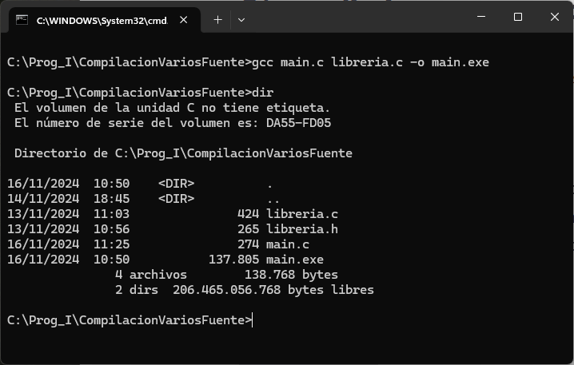
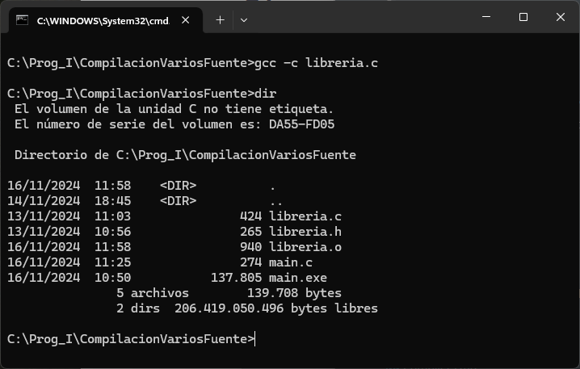
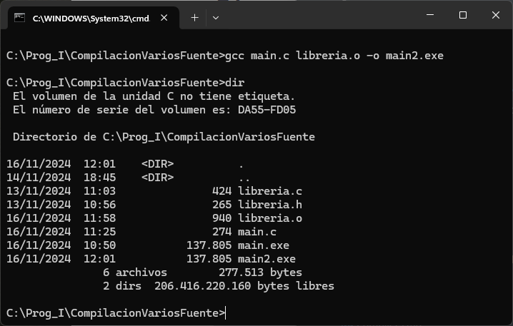

# Compilación de librerías

El proceso que llamamos comunmente *compilar* un programa, en realidad consta de varios procesos independientes y sucesivos. Cuando ejecutamos el compilador *gcc*, según los parámetros que le pasemos, ejecuta uno o más de esos procesos.

En lo que se refiere a este documento, los dos procesos principales son *compilar*, propiamente dicho y *enlazar*.

*Compilar* es traducir a código máquina un módulo de código fuente. *Enlazar (link)* consiste en unir uno o más módulos compilados para crear el ejecutable.

Para compilar un módulo de código fuente y obtener el código máquina correspondiente se utliza el parámetro `-c`del compilador. Por ejemplo:

```shell
gcc -c miprograma.c
```

Si no se producen errores de compilación, el resultado de la instrucción anterior será la obtención del fichero *miprograma.o*, el código máquina de *miprograma.c*. La extensión `.o` se refiere a *object* y al fichero se le suele llamar el *código objeto* del módulo en cuestión.

El proceso de enlazado consiste en unir uno o más ficheros objeto para crear el ejecutable.

Cuando se llama a *gcc*, se realizan varios procesos, entre ellos,  el compilado de los módulos fuente y el enlazado de todos los módulos que se le pasan: módulos fuente y módulos objeto.

Se explican a continuación varias formas de compilar un programa que utiliza una librería externa. El código del programa es *main.c* y el de la librería son los ficheros *libreria.h* y *libreria.c*.

El código de *main.c*

```c
#include <stdio.h>
#include "libreria.h"


int main() {

    int nums[] = {1, -1, 2, 4, 6, -3};

    int valor_max = maximo(nums, 6);
    int suma_valores = suma(nums, 6);

    printf("Máximo: %d\n", valor_max);
    printf("Suma  : %d\n", suma_valores);

    getchar();
}
```

El código de *libreria.h*:

```c
#pragma once

// Calcula el valor máximo entre los elementos del
// array que recibe como argumento
int maximo(int array[], int num_elementos);

// Calcula la suma de los elementos del array 
// que recibe como argumento
int suma(int array[], int num_elementos); 
```

Y el código de *libreria.c*:

```c
#include "libreria.h"

int maximo(int array[], int num_elementos) {
    int valor_max = array[0];
    for(int i=0; i<num_elementos; i++) {
        if(array[i]>valor_max) {
            valor_max = array[i];
        }
    }
    return valor_max;
}

int suma(int array[], int num_elementos) {
    int suma_valores = 0;
    for(int i=0; i<num_elementos; i++) {
        suma_valores += array[i];
    }
    return suma_valores;
}
```

## Forma 1: Tengo el código fuente de la librería

Si tenemos el código fuente de la librería, podemos compilar todo junto en una sola orden. El resultado será un fichero *.exe* que incluye el programa principal y la librería:

```shell
gcc main.c libreria.c -o main.exe
```

La salida por pantalla:



Se observa que el ejecutable, *main.exe*, ocupa 137.8 Kb.

## Forma 2: Utilizando el compilado de la librería

Es posible que la librería sea un desarrollo independiente que utilizo en varios programas. Para no tener que compilar la librería cada vez, puedo tenerla compilada de manera independiente y luego símplemente enlazarla con mis programas.

Para ello, compilo la librería de manera independiente, con la opción `-c` , que compila y genera el código objeto, pero no enlaza, genera un bloque compilado. Si no se especifica otro nombre de salida, el fichero tiene extensión `.o`.

```shell
gcc -c libreria.c
```

La salida en pantalla muestra el fichero *libreria.o* que se ha generado:



Ahora, para compilar un programa que utilice la librería, necesito el fichero *libreria.o* y el fichero *libreria.h*:

```shell
gcc main.c libreria.o -o main2.exe
```

La salida de pantalla:



Se puede ver que los tamaños de *main.exe* y *main2.exe* son iguales: 137.8 Kb.

Esta técnica se puede utilizar también para distribuir la librería sin necesidad de proporcionar el código fuente de la misma, símplemente tengo que proporcionar el fichero `.o` y el fichero `.h`.

También es útil, en programas extensos con muchos módulos, para no tener que compilar todo cada vez que quiero generar el programa. En esos casos, voy teniendo módulos compilados y, cuando construyo, solo recompilo lo que haya cambiado. Para gestionar ese tipo de proyectos se suele utilizar una herramienta de construcción. La más conocida en C es [make](https://www.gnu.org/software/make/).

## Librerías de enlace dinámico

Es habitual utilizar librerías que se enlazan con el programa de manera dinámica, esto es, en tiempo de ejecución, no en tiempo de compilación. En Windows, estas librerías suelen llevar la extensión *.dll* (*Dynamic Linked Library*). 

Utilizando librerías dinámicas, el programa principal no incorpora el compilado de la librería. Además, una misma librería se puede usar por varios programas, sin necesidad de disponer del código fuente de la librería ni de su código compilado ni del fichero *.h* . Solo necesita saber dónde va a estar el *.dll*. 

El siguiente código de *main2.c* es igual que el de *main.c*, pero se ha suprimido el *#include libreria.h*:

```c
#include <stdio.h>

int main() {

    int nums[] = {1, -1, 2, 4, 6, -3};

    int valor_max = maximo(nums, 6);
    int suma_valores = suma(nums, 6);

    printf("Máximo: %d\n", valor_max);
    printf("Suma  : %d\n", suma_valores);

    getchar();
}
```

Primero hay que generar el fichero *.dll* de la librería. Lo hacemos en dos pasos: primero compilamos la librería con el parámetro `-c` , para generar el compilado *libreria..o* y luego convertimos dicho compilado en una *librería compartida* utilizando el parámetro `-shared`:

```shell
gcc -c libreria.c
gcc -shared libreria.o -o libreria.dll
```

Ahora, al construir nuestro programa *main2*, enlazamos con la librería dinámica:

```shell
gcc main2.c -L./ -llibreria -o main2.exe
```

El parámetro `-L./` le dice al compilador que las librerías para enlazar están en el directorio actual. El parámetro `-llibreria` le dice que enlace (*link*) una librería que se llama `libreria`.

Al compilar emitirá unos avisos *warnings* indicando que en el programa principal se hacen llamadas implícitas a funciones que no tienen el correspondiente *.h*, pero al ejecutar el programa, funciona.
