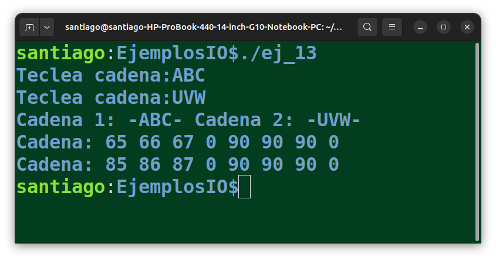
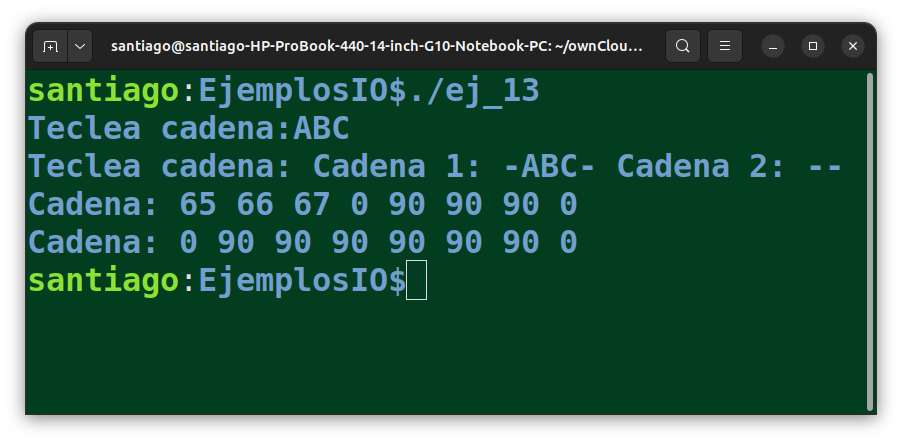
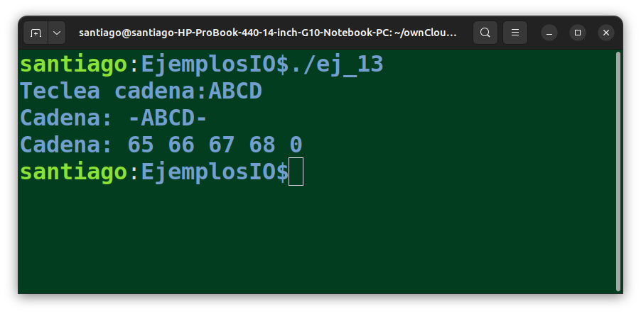
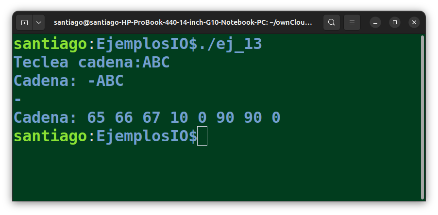
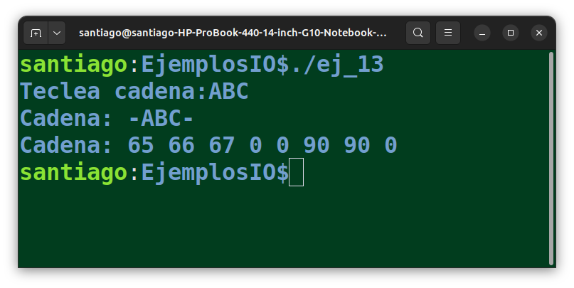

# Lectura de caracteres y cadenas en C

## Lectura de caracteres

Se puede utilizar *scanf()*, con el formato `%c`, utilizando un espacio delante del formato para evitar el problema de los `\n`residuales que pudiera haber en el búfer de lectura:

```c
char caracter;
scanf(" %c", &caracter);
```

Se puede no poner el espacio delante del formato `%c` pero, si no es la primera lectura, habrá que hacer un *getchar()* previo para descartar el `\n`. 

```c
#include <stdio.h>

int main() {
   char c, d;

   printf("Primer caracter: ");
   scanf("%c", &c);

   printf("Segundo caracter: ");
   getchar();
   scanf("%c", &d);

   printf("Primero: %c Segundo: %c \n", c, d);
}
```

También se puede usar *getchar()* directamente pero, si no es la primera lectura, habrá que tener cuidado con los `\n`residuales del búfer. 

```c
#include <stdio.h>

int main() {
   char c, d;

   printf("Primer caracter: ");
   c = getchar();

   printf("Segundo caracter: ");
   getchar();
   d = getchar();

   printf("Primero: %c Segundo: %c \n", c, d);
} 
```

## Lectura de cadenas con *scanf()*

Se pueden leer cadenas con *scanf()* y formato `%s`, pero habrá que tener en cuenta que para *scanf()*, los espacios indican el fin de la lectura y, por tanto, no se podrán leer cadenas que contengan espacios.

El formato `%s`funciona como los formatos numéricos y descarta directamente los `\n`residuales. No hace falta el truco del espacio delante del formato.

También hay que señalar que con *scanf()*, no hay que poner `&`delante del nombre de la variable, pues el nombre de una cadena ya es un puntero:

```c
#include <stdio.h>

int main() {
   char c[40], d[40];

   printf("Primera cadena: ");
   scanf("%s", c);

   printf("Segunda cadena: ");
   scanf("%s", d);

   printf("Primera: %s Segunda: %s \n", c, d);
}
```

## Lectura de cadenas con *gets()*

También se pueden leer cadenas con *gets()*. En este caso, se pueden leer cadenas con espacios, el final de la cadena lo marcan los `\n`o los `EOF` (*CTRL+Z*). 

```c
#include <stdio.h>

int main() {
   char c[40], d[40];

   printf("Primera cadena: ");
   gets(c);

   printf("Segunda cadena: ");
   gets(d);

   printf("Primera: %s Segunda: %s \n", c, d);
}
```

La función *gets()* lee el último `\n`y lo descarta, añadiendo un `\0`en su lugar a la cadena leída. Por ello, se pueden hacer varias lecturas consecutivas con *gets()* sin que haya que tomar precauciones con los `\n`residuales.

```c
#include <stdio.h>

#define DIM 8

void print_cadena(char* c) {
   printf("Cadena: ");
   for(int i=0; i<DIM; i++) {
      printf("%d ", c[i]);
   }
   printf("\n");
}

int main() {

   char c[DIM]="ZZZZZZZ";
   printf("Teclea cadena:");
   gets(c);

   char d[DIM]="ZZZZZZZ";
   printf("Teclea cadena: ");
   gets(d);

   printf("Cadena 1: -%s- Cadena 2: -%s-\n", c, d);

   print_cadena(c);
   print_cadena(d);
}
```

La salida de este programa muestra cómo se han leído las cadenas, añadiendo un `\0`al final de lo leído y sin dejar un `\n`residual en el bufer:



Ahora bien, si ya existían `\n`residuales en el bufer, porque las anteriores lecturas se hicieron con *scanf()*, la función *gets()* leerá una cadena vacía:

```c
#include <stdio.h>

#define DIM 8

void print_cadena(char* c) {
   printf("Cadena: ");
   for(int i=0; i<DIM; i++) {
      printf("%d ", c[i]);
   }
   printf("\n");
}

int main() {

   char c[DIM]="ZZZZZZZ";
   printf("Teclea cadena:");
   scanf("%s", c);

   char d[DIM]="ZZZZZZZ";
   printf("Teclea cadena: ");
   gets(d);

   printf("Cadena 1: -%s- Cadena 2: -%s-\n", c, d);

   print_cadena(c);
   print_cadena(d);
}
```



En la salida se observa que el *scanf()* también añade el carácter `\0`al final de lo leído. Pero deja el `\n`residual y el siguiente *gets()* lee una cadena vacía. En la segunda cadena se ve que se ha añadido un `\0`como primer carácter de la cadena leída.

Otro de los problemas de *gets()* es que se puede producir **desbordamiento del búfer**, si la cadena tecleada es mayor que la cadena que había preparada en memoria. En estos casos, *gets()* escribirá más alla de las posiciones de la cadena en memoria, pudiendo sobreescribir cualquier cosa que hubiera en esas posiciones de memoria.

En el siguiente código se ha modificado la función *print_cadena()* para que escriba un carácter más alla de la longitud de la cadena:

```c
#include <stdio.h>

#define DIM 4

void print_cadena(char* c) {
   // Modificado para que escriba un carácter 
   // más allá del final de la cadena
   printf("Cadena: ");
   for(int i=0; i<=DIM; i++) {
      printf("%d ", c[i]);
   }
   printf("\n");
}

int main() {

   char c[DIM]="ZZZ";
   printf("Teclea cadena:");
   gets(c);

   printf("Cadena: -%s- \n", c);

   print_cadena(c);
}
```

Si ejecutamos este código y tecleamos una cadena de 4 caracteres, se observa que *gets()* ha escrito el `\0`en la posición de memoria que hay a continuación del final de la cadena `c`. La cadena la podemos imprimir, porque sigue teniendo el `\0`final, pero lo que hubiera ahí, se lo ha cargado:



Por este y otros motivos, la función *gets()* se descartó de C a partir de C11 y, a día de hoy, se recomienda utilizar *fgets()*. De hecho, cuando se compila un programa usando *gets()* el compilador emite un warning.

> Al escribir en memoria más alla de la longitud de la variable, el comportamiento del programa es indefinido. Puede pasar que sea a una zona de memoria del propio programa o que ni siquiera pertenezca al programa, en cuyo caso se producirá un error de ejecución. Si la zona pertenece al programa, podría ser una zona de solo lectura, con lo que también habrá error de ejecución. Finalmente, si la zona de memoria es del programa y no es de solo lectura, el resultado dependerá de si es una zona libre de la memoria o una posición que ya estaba ocupada por otra variable, cuyo contenido se verá alterado.

## Lectura de cadenas con *fgets()*

Es la forma recomendada para leer cadenas. La sintaxis es la siguiente:

```c
char* fgets(char* str, int n, FILE* stream);
```

Los parámetros de la función:

- **char* str :** un puntero al array de caracteres donde se almacenará la lectura. El array tiene que tener la longitud suficiente para guardar los caracteres leídos, incluyendo el caracter final `\0`.
- **int n:** El número máximo de caracters que se leerán, incluyendo el `\0`final. La función *fgets()* leerá *n-1* caracteres, dejando sitio para el `\0`final. Si se intenta dar a este parámetro un valor mayor que el de la cadena, el compilador genera un aviso.
- **FILE* stream:**  un puntero a un objeto del tipo *FILE* que especifica de dónde se leerán los caracteres. Puede ser un fichero o *stdin* en el caso de leer caracteres del terminal.

Si la lectura tiene éxito, la función *fgets()* devuelve un puntero al mismo array que se ha utilizado para guardar la lectura. Si se produce algún error, se devuelve NULL.

Quizás, el problema con *fgets()* es que no descarta el salto de línea `\n`final de la cadena, si existe. En el siguiente código se lee una cadena del terminal usando *fgets()*. 

```c
#include <stdio.h>

#define DIM 8

void print_cadena(char* c) {
   printf("Cadena: ");
   for(int i=0; i<DIM; i++) {
      printf("%d ", c[i]);
   }
   printf("\n");
}

int main() {

   char c[DIM]="ZZZZZZZ";
   printf("Teclea cadena:");
   fgets(c, DIM, stdin);

   printf("Cadena: -%s- \n", c);

   print_cadena(c);
}
```

Si se ejecuta el programa y se teclea una cadena de 3 caracteres, en la cadena se guarda el `\n`final (código ASCII 10):



Para eliminar el `\n`final, se puede usar la función *strlen()* para comprobar si el último carácter es `\n`y, si es así, sustituirlo por un `\0`.

La función *strlen()* pertenece a la librería *string.h*. Devuelve el número de caracteres de la cadena, excluyendo el `\0`final. Por tanto, el índice del último carácter no nulo de la cadena es `strlen(cad)-1`.

```c
#include <stdio.h>
#include <string.h>

#define DIM 8

void print_cadena(char* c) {
   printf("Cadena: ");
   for(int i=0; i<DIM; i++) {
      printf("%d ", c[i]);
   }
   printf("\n");
}

int main() {

   char c[DIM]="ZZZZZZZ";
   printf("Teclea cadena:");
   fgets(c, DIM, stdin);

   int ultimo_caracter = strlen(c)-1;
   if(c[ultimo_caracter] == '\n') {
      c[ultimo_caracter] = '\0';
   }

   printf("Cadena: -%s- \n", c);
   print_cadena(c);
}
```

Ejecutando el programa y tecleando una cadena de 3 caracteres:



En relación con los `\n`residuales que pudiera haber en el búfer cuando se llama a *fgets()*, se dan los mismo problemas que se han comentado con *gets()*. Si antes de llamar a *fgets()* se han hecho lecturas con *scanf()*, habra que usar un *getchar()* para descartar el `\n`residual.
